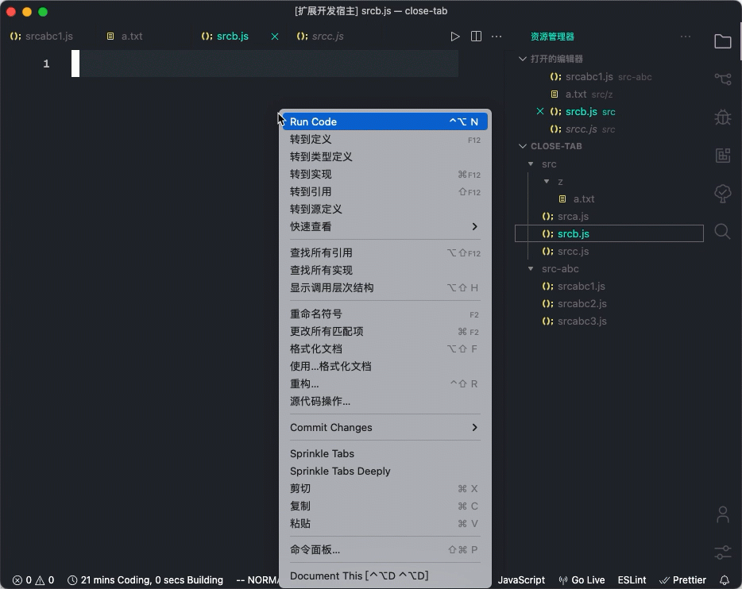

Close same directory/subdirectory files with one click.

一键关闭同目录/子目录的文件。

## Features

-   Close same directory/subdirectory files with one click.
-   Work with Explorer Context Menu/ Editor Context Menu / Editor Title Menu
-   Work With TabGroups
-   Work With SubFolder

## Extension Settings

This extension contributes the following settings:

-   `closefiles.closeAllTabGroup`: Enable close files in allTabGroup. Default is false(only work in activeTabGroup)

## Release Notes

### 1.0.0

Initial release of `Close Folder`

### 1.1.0

fixed similar path issue

### 2.0.0

-   rename to `Tab Sprinkle`
-   refactoring

### 2.1.0

-   fix issue
-   add howto.gif

### 2.2.0

-   fix issue
